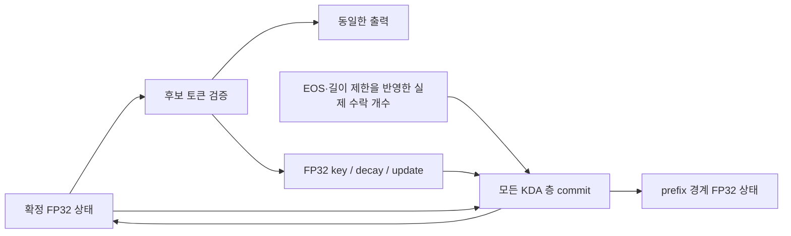

# GB10 × 4 전용 ST 실행 형상

검토 기준: `e0b5c184`에서 분석을 시작하고 GPU 등록 전에 `71306bda`에 리베이스한 엔진 및 2026-09-13 공식 문서. 목표는 **C=1의 품질을 유지하면서 토큰당 가중치 읽기, 상태 쓰기, 중간 텐서 이동을 줄이는 것**이다. 첫 구현은 FP32 KDA의 물리적 저장 형상을 바꾸는 커널 실험이다. 서빙 연결과 처리량 검증은 아직 완료하지 않았다.

구체적인 cache 수명, packet 입력 ABI, expert 타일 선택식, 구현 순서와 인수 조건은 [후속 설계](ST_GB10_FOLLOWUP_DESIGN_20260913.md)에 정리했다. 후속 설계의 API와 scheduler는 아직 구현되지 않았다.

## 하드웨어가 정해 주는 방향

각 GB10의 메모리는 CPU와 GPU가 공유하는 128 GB LPDDR5x이며 대역폭은 273 GB/s다. 따라서 CPU의 큰 복사·초기화도 GPU와 같은 메모리 자원을 사용한다. 네 노드의 로컬 메모리 용량을 하나의 GPU 주소 공간으로 취급하지 않는다. [NVIDIA 하드웨어 명세](https://docs.nvidia.com/dgx/dgx-spark/hardware.html)

노드 사이에는 ConnectX-7 Ethernet/RoCE 경로가 있다. 포트의 명목 상한은 200 Gbit/s, 즉 25 GB/s이며 실제 전송량은 케이블·연결 구성·프로토콜에 달려 있다. 두 포트의 숫자를 바로 더해 실효 대역폭으로 쓰지 않는다. [NVIDIA 네트워크 명세](https://docs.nvidia.com/dgx/dgx-spark/spark-clustering.html)

이 조건에서는 네 노드가 각자 가진 가중치를 읽어 계산하고 작은 결과를 교환하는 C=1 TP4 형상을 우선 유지한다. EP나 attention DP는 단계별로 따져 볼 실험이며, TP4 전체를 일괄 교체할 근거는 아직 없다.

vLLM에도 DBO가 있고 SGLang에도 TBO·SBO 및 expert 배치 최적화가 있다. 중첩 자체를 ST만의 기능으로 주장할 수 없다. ST가 유리한 지점은 **이 모델·이 장비·이 운용 목적에 맞춰 가중치 포맷, 커널 입력, 통신 패킷, 캐시 수명, 실행 그래프를 함께 바꿀 수 있다는 것**이다. [vLLM DBO](https://docs.vllm.ai/en/latest/design/dbo/), [SGLang EP](https://docs.sglang.io/docs/advanced_features/expert_parallelism)

## 이미 있는 기반과 다음 변경

| 경로 | 현재 ST에 있는 것 | 다음에 바꿀 물리적 경계 |
| --- | --- | --- |
| 디코드 제어 | CUDA graphs, 유한 shape, 최대 4회 device 반복 | 상태의 확정 시점을 그래프의 명시적 저장 경계로 사용 |
| 통신 → mHC | OneShot rank packet을 다음 mHC가 직접 소비 | MoE 최종 합산도 송신 슬롯에 직접 생산하도록 확장 |
| KDA 검증 | FP32 update factor를 기록하고 수락 후 materialize하는 선택 경로 | K+1 전체 링을 확정 상태·prefix 경계 두 레코드로 교체 |
| 프리필 | token sharding, FP8 collectives, KDA packet projection | router·MoE activation pack·shared expert가 packet을 직접 소비 |
| MoE | expert별 정적 타일 및 가중치 재사용 | 디코드 우선권을 가진 프리필/디코드 공용 expert 타일 실험 |
| 빌드 | kernel shape 선언과 커널 캐시, graph shape 공유 | 선택한 경로의 의존성과 물리 ABI만 실행 이미지에 포함 |

현재 구현: [execution.py](../engine/profiles/glm53/execution.py), [direct_mhc.py](../engine/profiles/glm53/direct_mhc.py), [deferred.py](../engine/kernels/kda/deferred.py), [prefill_collectives](../engine/kernels/prefill_collectives/__init__.py), [net.py](../engine/profiles/glm53/net.py).

전용 실행 이미지는 다음 항목을 함께 고정한다.

1. SM121·TP4·모델 가중치/양자화 식별자와 커널 입력 포맷.
2. C=1, C=4 및 실제 필요한 중간 배치, 검증 폭, 프리필 타일의 유한 집합.
3. 슬롯 안의 필드 배치와 수명, rank packet의 소비 순서, 그래프 진입점.
4. 커널 소스 의존성·컴파일러·CUDA 이미지·수치 정책으로 만든 빌드 식별자.

GPU 절대 주소, NIC 등록 키와 GID는 부팅 시 바인딩한다. 저장한 주소를 다른 프로세스에서 재사용하지 않는다. 이 선언만 추가해서 속도가 빨라지는 것은 아니다. 아래처럼 실제 저장과 이동을 없애는 변경이 실행 이미지에 들어가야 한다.

## 1. 구현: KDA를 확정 상태 중심으로 저장

기존 링은 각 KDA 층·요청마다 `K+1`개의 `[H,Kdim,Vdim]` FP32 상태를 둔다. 검증 결과의 수락 위치로 되돌아갈 수 있기 때문이다. 기존 deferred 경로는 쓰기를 줄이지만 이 링의 할당 크기는 유지한다.

새 커널은 다음 레코드를 사용한다.



`Batch(..., boundaries=...)`로만 새 ABI를 선택한다. 현재 서빙 캐시는 이 인수를 전달하지 않는다.

- 검증 커널은 확정 상태 한 셀을 읽고 기존 FP32 연산 순서로 출력과 update factor를 계산한다. 확정 상태와 경계 레코드는 쓰지 않는다.
- 수락 이후 하나의 커널이 실제 수락된 update만 재생하고 확정 상태를 저장한다. 경계를 건넜다면 별도 레코드에도 저장한다.
- 경계와 마지막 위치가 같은 홀짝일 수 있으므로 두 칸짜리 modulo 링으로 대체하면 안 된다. 두 레코드는 독립 주소를 가진다.
- `count=0`과 범위를 벗어난 count는 상태를 쓰지 않는다. 슬롯과 문맥 값의 유효성·동일 스트림 소유권은 호출자의 계약이다.
- `tokens <= prefix block`을 요구해 한 commit에서 경계를 최대 한 번 통과하도록 한다.
- 경계 레코드는 다음 경계 통과 전에 소비해야 한다. 같은 슬롯에서 factor를 다시 쓰기 전에 이전 commit을 끝내야 한다.

이 형상에서는 검증 폭 K를 바꿔도 요청의 영구 상태 배치가 바뀌지 않는다. 각 검증 graph의 factor workspace만 달라진다. 따라서 후속으로 수락률과 실제 검증 비용에 따라 유한한 K graph를 선택할 때, 살아 있는 요청의 recurrent ring을 재배치하는 비용을 없앨 수 있다. 이번 변경은 동적 K 선택 자체를 구현하지 않는다.

34층, rank당 16헤드, 128×128 FP32에서 한 상태는 요청·rank당 34 MiB다.

| K=7, 요청·rank당 | 상태 본체 | factor 작업 공간 |
| --- | ---: | ---: |
| 일반 8칸 링 | 272 MiB | 없음 |
| 기존 deferred 8칸 링 | 272 MiB | 6.375 MiB / 활성 검증 행 |
| 새 확정·경계 레코드 | 68 MiB | 6.375 MiB / 활성 검증 행 |

**상태 본체 204 MiB, 75% 감소**는 형상에서 직접 계산되는 값이다. 표는 conv·indexer·drafter·KV·null slot·정렬 padding·offset metadata를 제외하며 엔진 전체 메모리 절감률이 아니다. factor는 요청 영구 캐시가 아니라 검증 shape 소유의 workspace다. 기존 서빙의 별도 boundary stage도 이 표에 포함하지 않았다. 최종 통합에서는 새 경계 레코드가 그 stage의 recurrent 필드를 대신하고 conv staging은 별도로 유지해야 한다.

정확도 검증 코드는 [test_engine_kda_compact.py](../tests/test_engine_kda_compact.py)에 있다. C=1/C=4, 검증 폭 6/7/8, 모든 수락 개수, 경계·거절·슬롯 재바인딩·prefix 복원 모사, 한 graph의 4회 commit, 큰 int64 위치, padding과 주소 겹침을 검사한다. 비교 대상은 기존 FP32 전체 링이다.

계측은 [engine_kda_compact_bench.py](../probes/engine_kda_compact_bench.py)에서 일반 링 / 기존 deferred / 새 레코드를 같은 빌드로 비교한다. 34층 recurrence와 commit을 측정하며 실제 모델의 projection·conv·NIC·sampler·출력 tok/s는 포함하지 않는다. 초기화·컴파일·캡처는 측정 구간 밖이고, 64 MiB eviction 유무와 원시 샘플을 별도로 남긴다. 새 경로의 경계 레코드 쓰기는 측정에 포함되지만 기존 경로의 후속 stage 복사는 포함되지 않는다.

서빙 통합에 남은 일:

1. `Glm53Caches`에 명시적인 상태 배치를 연결하고 기존 FP32 기준 KV 블록 수를 유지한 채 arena를 줄인다.
2. prefill 최종 상태, checkpoint/restore, stage, 작은 eager decode를 같은 두 레코드 규약으로 연결한다. 작은 decode는 verify 후 전체 count commit을 해야 한다.
3. C=1/C=4와 문맥 capacity별 graph가 같은 물리 상태를 공유하고, 각자 필요한 factor만 소유하도록 한다.
4. bounded decode의 EOS clipping·경계 stage·슬롯 반환 순서를 검증한다. 단순히 `rec_ring=1`로 바꾸는 패치는 올바르지 않다.
5. 같은 런타임에서 C=1 우선 품질·수락률·tok/s 및 C=4, 32K/128K TTFT를 비교한다.

## 2. 프리필: FP8 패킷을 연산의 입력으로 유지

현재 큰 프리필은 FP8로 통신하지만 일부 소비자는 이를 전체 BF16 hidden으로 풀어 놓는다. KDA 입력 projection에는 이미 packet consumer가 있다. 다음 대상은 매 FFN의 gather 뒤에 있는 router와 activation pack이다.

구현 목표는 `packet → 전체 BF16 hidden → router/pack`에서 전체 hidden 저장·재읽기를 제거하는 것이다. router의 FP32 누산, 기존 FP8 roundtrip의 BF16 반올림, expert 입력의 양자화 경계를 각각 유지해야 한다. 선형 연산의 위치를 바꾸거나 FP8을 그대로 곱해도 자동으로 같은 값이 되는 것은 아니다.

예를 들어 32,256×4,096 BF16 hidden 한 장은 252 MiB다. 이 한 장의 저장·재읽기 1회는 504 MiB에 해당한다. 전체 hidden을 소비하던 모든 경로를 packet consumer로 교체했을 때 제거할 수 있는 연산의 바이트 계산이며, 추가 packet 읽기·양자화 비용까지 반영한 전체 트래픽 순감소나 속도 예측이 아니다. 네트워크 패킷 자체의 크기는 그대로다.

첫 실험은 **전체 all-gather 한 번을 유지하면서 router + routed-expert activation pack + shared expert gate/up**이 같은 패킷을 소비하게 한다. shared projector는 기존 KDA consumer를 재사용하되 expert pack은 expert별 scale을 유지한다. 작은 통신 tile을 여러 번 보내는 변경은 다음 실험으로 분리한다. 어떤 소비자라도 전체 hidden을 계속 요구한다면 전체 materialization을 제거했다고 기록하지 않는다.

## 3. MoE: 프리필과 디코드가 같은 가중치 읽기를 사용

[C=4 분석 기록](../measurements/c4_scaling_20260913/README.md)의 #838 계열 측정에서는 MoE 비중이 약 60–65%, 정적 MoE 실효 대역폭이 약 207 GB/s로 해석됐다. 이는 과거 K=6 런타임의 구성요소 분석이며 현재 HEAD의 실측 비중이 아니다. 같은 기록의 두 스트림 프리필/디코드 중첩도 대역폭 경쟁으로 유의미한 이득을 보이지 않았다.

따라서 큰 C=1 개선을 목표로 할 다음 연구는 **한 번 읽은 expert 가중치에 더 많은 유효 토큰을 태우는 것**이다. 디코드의 기존 M32 타일 수를 늘리지 않는 범위에서 같은 층의 준비된 프리필 route를 붙인다. 다만 빈 행을 채워도 남은 M128 프리필 타일 수가 줄지 않으면 별도 가중치 읽기는 남는다. 후속 설계는 실제로 프리필 타일을 제거하는 후보부터 선택하며, BF16 atomic 합산 순서 변화와 cold expert 완료 비용까지 검증하도록 구체화했다.

필수 제약은 다음과 같다.

- 프리필 전체 청크를 단순 결합하면 디코드가 청크를 기다리므로 C=1 목표를 해친다.
- 디코드가 방문하지 않은 cold expert의 프리필도 완료해야 한다. 별도 시간 예산과 공정성이 필요하다.
- 서로 다른 요청의 상태·출력 위치·수락 여부를 분리하고 expert 출력은 원래 순서와 정밀도로 결합해야 한다.
- 이미 있는 expert별 행 묶기와 구분해, 실제 두 작업 사이의 가중치 읽기 절감을 측정해야 한다.

이는 scheduler의 청크 분리부터 MoE 타일의 완료 신호까지 바꾸는 연구다. 이번 커널 PR에는 포함하지 않았다. 임의의 2배 가속 예상치를 붙이지 않는다.

## 판단 순서와 검증 상태

| 순서 | 질문 | 채택 근거 |
| --- | --- | --- |
| 1 | 두 레코드로 FP32 상태 소유권을 유지할 수 있는가? | GPU byte-exact 상태/출력과 graph 재사용, 물리 메모리 감소 |
| 2 | packet consumer로 큰 중간 hidden을 없앨 수 있는가? | 실제 producer/consumer 트래픽 감소와 32K/128K TTFT |
| 3 | MoE 가중치 읽기를 여러 작업이 공유할 수 있는가? | C=1 tok/s를 보호한 프리필 진전량, cold expert 완료 보장 |
| 4 | 두 phase의 병렬 배치를 바꿀 가치가 있는가? | TP4 대비 계산·NIC·캐시 전환 비용을 모두 포함한 결과 |

Python dispatch 제거, 모든 연산의 단일 persistent kernel화, 작은 batch의 무조건 EP 전환은 현재 우선 변경이 아니다. CUDA graph가 이미 가리는 비용과 register pressure·통신·부하 불균형을 포함해 판단한다.

현재 CPU 검사: admission 26개와 기존 state publication 계약 5개 통과. CUDA 관련 10개 테스트는 이 Mac에서 건너뛰었다. Python 구문과 diff 공백 검사 통과. GPU 접근을 제거한 CPU 컨테이너에서 SM121 8개 형상의 컴파일도 통과했다. 같은 arena 주소·정렬 정보를 사용하도록 바꾼 뒤 새 commit의 레지스터가 64→56개, compiler shared metadata가 2,048→512 bytes로 줄었다. [컴파일 원본과 실행 환경](../measurements/kda_compact_20260913/README.md)

**새 커널의 GPU 정확도·시간 및 서빙 성능은 미검증**이다. 네 대를 점유한 다른 세션의 재양자화 작업을 우회하지 않고 정식 큐에서 실행한다.

컨트롤러의 고정 checkout에서 실행할 명령:

```bash
ST_IMAGE=sha256:09d9ba96a4c7e1113f91100b892a94c1ab859dae8e46db3e7b02dfa2564f93bc \
bash bench/fleet.sh run --gpu --fleet --detach st-kda-compact0913v3 5 \
  'K7 compact FP32 state: exact recurrence and three-layout component comparison' -- \
  bash probes/run_engine_probe.sh probes/engine_kda_deferred_check.py \
  --compact-only --samples 8 --output /cache/kda-compact0913v3.json
```

이 명령은 모델을 부팅하지 않는 kernel probe다. 네 대를 독점 점유한 기존 세션의 GPU 사용이 끝난 뒤 실행하도록 fleet 예약을 사용한다. 등록 결과 `accepted=true`, 상태 `queued`, ticket `17893082511214606`을 확인했다. [등록 원본](../measurements/kda_compact_20260913/admission.json)
