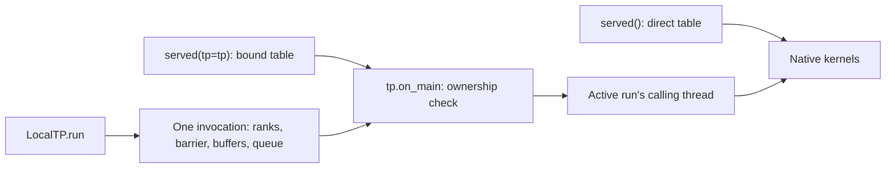

# ST execution ownership — 2026-09-11

Base: `73fa7dabbb4200952b57769660d4373be7118165`, merged PR #543.
Measured implementation: `80b82df6`. Latest main at `d4528459` (PR #542) was
subsequently integrated without conflicts. Within the 147 measured Python
files, only comments in `specs.py` changed; its AST is identical and the other
146 file hashes still match. The upstream launcher/ledger changes are retained.

This change makes kernel dispatch and LocalTP invocation lifetime explicit.
It is an execution-architecture qualification, with no throughput or full-model
quality claim.

## Problem and resulting architecture

GLM's served lane closures previously looked up a mutable process-wide `_TP`
value on every call. Constructing or starting another local judge could change
where an existing table dispatched its kernels. `LocalTP` also kept its barrier,
exchange slots, results and job queue on the executor across invocations. A
rank failure left the barrier broken; old rank handles kept accessing whichever
invocation later used that executor, and completed results could remain retained.

The served factory now accepts an explicit `tp` owner. Bound closures capture
that object; a later factory call cannot change their owner. Direct tables have
no dispatch wrapper or global lookup. The old `bind_tp` API is removed, and the
boot/check entry points and indexer probes have been migrated.



Each invocation allocates its own control state. A nonblocking ownership lock
rejects overlap/reentry on the same executor. Rank handles carry their specific
invocation and can only be used by their own rank thread while it is active.
Idle dispatch, foreign threads and handles from completed invocations fail
before a kernel runs or a collective waits.

On failure, the invocation aborts its collective barrier and cancels queued
kernels, allowing waiting callers to receive an error. Started rank threads are
joined before ownership is released, including partial thread-start failures.
The original non-peer error is preserved as the raised exception's cause.
Exchange/result references are cleared on exit. A subsequent **explicit** run
gets fresh control state. This does not automatically retry model execution or
recover model/KV data or a failed CUDA context.

Independent LocalTP instances can run concurrently with separate owners and
collectives. The group used to load/run a local model still owns the complete
model execution; keep its rank handle inside that invocation. The fleet's NCCL
`Comm` implementation and numerical kernel implementations are unchanged.

## API usage

```python
from engine.base.comm import LocalTP
from engine.profiles.glm53 import lanes

direct = lanes.served()        # fleet or explicit direct warmup
owner = LocalTP(4)
local = lanes.served(tp=owner) # use inside owner.run(...)
results = owner.run(lambda comm: local.indexer_quant(query_rows))
```

A bound table may be reused in a later invocation of its same executor. A rank
handle may not. Reference tables keep their existing plain torch behavior.
`check.py` now constructs its local owner before binding served lanes; the
reference-only local boot no longer changes unrelated process-wide state.

## Validation

- **123 engine tests passed in the CUDA runtime, zero skips.** CPU-only execution
  passed 81 tests and skipped 42 requiring torch/CUDA. Raw logs are retained.
- Eleven CPU ownership regressions cover independent concurrent groups,
  repeated dispatch/collectives, invalid geometry, idle/stale/foreign access,
  overlap/reentry, original rank errors, queued-kernel cancellation, partial
  thread-start failure, a missing collective participant, and reference release.
  They passed **20 repeated runs / 220 test executions** (`ownership-stress.log`).
- Two GPU regressions check exact tensor all-reduce/all-gather before and after
  an injected rank failure, and two concurrent lane tables bound to separate
  executors. The native quantizer produces identical FP8 bytes/scales, traced
  kernel calls stay on their owning thread, all bound lane fields reject idle
  dispatch, and an existing direct table remains direct.
- `engine_execution_check.py` exercises **nine real native lane paths on four
  logical ranks for three runs**: conv, recurrent KDA, mHC pre/post, indexer
  quantization, pool expansion, slot finalization, indexer logits and kpool
  compression. All outputs/states match direct calls **byte-for-byte**, and
  tensor all-reduce/all-gather are exact. A rank failure is injected between
  the first and second runs; subsequent runs using the same bound table pass.
- The standalone image has no installed or loaded `vllm` package. These are
  synthetic kernel inputs; no model checkpoint is needed. The unchanged fleet
  NCCL path, full-model output quality and fleet ITL/throughput were not rerun.

## Evidence and reproduction

`source-sha256.json` records **147 engine/test/probe Python files**, verified
against measured revision `80b82df6`. `integration-source-sha256.json` and
`integration-check.log` record the final source after the comments-only Python
integration from main. `engine-tests.log`, `cpu-tests.log`,
`ownership-stress.log`, `execution.log`, `execution.json` and `environment.log`
retain the checks and environment; log cleanup removes trailing whitespace only.

GPU checks ran in `/home/choiceoh/st-engine-f4d7-execution` on srv1 GB10, with
current source mounted at `/repo`, `PYTHONPATH=/repo`, `OMP_NUM_THREADS=2`, two
CPUs and an isolated JIT cache. The unit suite had a 6 GiB memory limit; the
native-kernel probe had a 10 GiB limit. Existing services were left untouched.

Runtime: `st-engine:9391`, torch `2.13.0+cu130`, CUDA 13.0. Immutable image ID:
`sha256:0d781f0a8f77d4735d0d09d57b081c9489b3a46131dc72773fd40fcbf267b446`.

Inside that runtime with this checkout and writable evidence/cache mounts:

```bash
python3 -m unittest discover -s tests -p 'test_engine_*.py' -v
python3 probes/engine_execution_check.py --output /evidence/execution.json
```

For the repeated CPU ownership check from the repository root:

```python
import sys, unittest
sys.path.insert(0, 'tests')
from test_engine_execution import ExecutionOwnershipTests
for _ in range(20):
    suite = unittest.defaultTestLoader.loadTestsFromTestCase(ExecutionOwnershipTests)
    assert unittest.TextTestRunner().run(suite).wasSuccessful()
```
